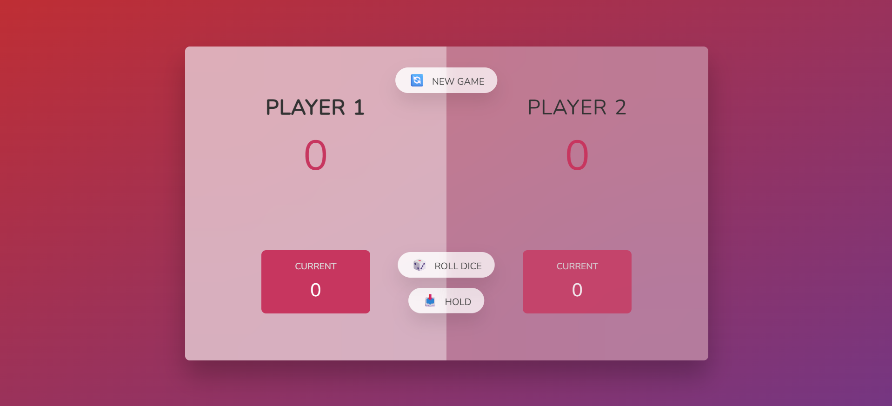

# Pig Game 🎲

A simple and fun dice game for two players, built with HTML, CSS, and JavaScript.

---

## Game Preview

<!-- Add a screenshot or GIF of your game below -->

<!-- Replace 'screenshot.png' with your actual image file -->

---

## How to Play

- **Players:** 2
- **Goal:** Be the first to reach 100 points.
- **Rules:**
  1. On your turn, roll the dice as many times as you like. Each roll adds to your current score.
  2. If you roll a 1, your turn ends and you lose your current score.
  3. You can choose to "Hold" to add your current score to your total score and pass the turn.
  4. The first player to reach 100 points wins!

---

## Features

- Modern, responsive UI
- Smooth gameplay
- Easy to reset and start a new game

---

## Getting Started

1. \*\*Clone the repository: https://github.com/vinod24256/pig_game.git
2. **Open `index.html` in your browser.**

---

## Technologies Used

- HTML5
- CSS3
- JavaScript (ES6)

---

## Credits

Created by vinod.  
Inspired by Jonas Schmedtmann's JavaScript course.

---

## License

This project is licensed under the MIT License.
